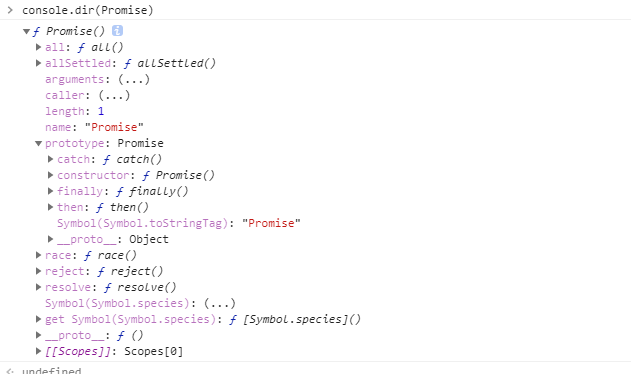

### 同步和异步

同步需要事件一件一件的完成，下一件事情需要等待上一件事情完成后才能开始（所谓堵塞）
异步不需要等待，谁先来谁先开始，多个事件可同时发生

### 回调函数

回调函数函数是一个函数，将会在另外一个函数结束后立即执行，它作为参数传入到另外一个函数内部执行。

javascript是单线程的，本质上事件总是阻塞的，但是有些任务耗时长，在这种情况下我们需要等待，但是时间不允许我们等待，所以我们需要异步编码，而回调函数就是来处理这些问题的，所以回调函数本质上是异步的。

``` js
    function callback() {
        console.log('Done');
    }
    console.log('before setTimeout()');
    setTimeout(callback, 1000); // 1秒钟后调用callback函数
    console.log('after setTimeout()');
```

> 输出顺序
> before setTimeout()
> after setTimeout()
> (等待1秒后)
> Done

### 回调地狱

当多个异步函数一个接一个的执行时，就会出现可怕的回调地狱，也叫厄运金字塔。这样是代码变得冗余而且难以维护。

### 回调函数使用场景

1. 资源加载：动态加载js文件后执行回调，加载iframe后执行回调，ajax操作回调，图片加载完成执行回调，AJAX等等。
2. 事件：DOM事件及Node.js事件基于回调机制 (Node.js回调可能会出现多层回调嵌套的问题)。
3. setTimeout的延迟时间为0，这个hack经常被用到，settimeout调用的函数其实就是一个callback的体现
4. 链式调用：链式调用的时候，在赋值器(setter)方法中(或者本身没有返回值的方法中)很容易实现链式调用，而取值器(getter)相对来说不好实现链式调用，因为你需要取值器返回你需要的数据而不是this指针，如果要实现链式方法，可以用回调函数来实现【不太能理解】
5. setTimeout、setInterval的函数调用得到其返回值。由于两个函数都是异步的，即：他们的调用时序和程序的主流程是相对独立的，所以没有办法在主体里面等待它们的返回值，它们被打开的时候程序也不会停下来等待，否则也就失去了setTimeout及setInterval的意义了，所以用return已经没有意义，只能使用callback。【不太理解】callback的意义在于将timer执行的结果通知给代理函数进行及时处理。

### promise

官方定义：

> Promise 对象是一个代理对象（代理一个值），被代理的值在Promise对象创建时可能是未知的。它允许你为异步操作的成功和失败分别绑定相应的处理方法（handlers）。 这让异步方法可以像同步方法那样返回值，但并不是立即返回最终执行结果，而是一个能代表未来出现的结果的promise对象
>> 一个promise有以下三种状态:

pending: 初始状态，既不是成功，也不是失败状态。
fulfilled: 意味着操作成功完成。
rejected: 意味着操作失败。

不多说，在浏览器打印Promise:



可以看出Promise有all、reject、resolve等方法，在原型prototype上面还有then、catch方法，这就意味着new出来的Promise对象都有then和catch方法

#### 构造Promise对象

``` js
    let p = new Promise((resolve, reject) => {
        // 异步操作
        setTimeout(function() {
            let data = Math.random() * 10
            if (data > 5) {
                console.log('procced successful')
                resolve('大于5')
            } else {
                reject('小于等于5')
            }

        }, 2000)

    })
    p.then(
        res => {
            console.log(res) // 大于5
        },
        rej => {
            console.log(rej) // 小于等于4
        }
    )
    // then方法可以接受两个参数，第一个对应resolve的回调，第二个对应reject的回调
```

Promise对象接受两个参数，第一个resolve代表成功后返回的数据，第二个reject代表失败后返回的数据，成功和失败在这定义并不是一定的。按照标准来讲，resolve是将Promise的状态置为fullfiled，reject是将Promise的状态置为rejected。使用.then()方法可以将promise中返回的数据调用

#### catch使用

.catch用来捕获异常，效果和.then的第二个参数差不多，但是他还有一个功能：在执行resolve的回调（也就是上面then中的第一个参数）时，如果抛出异常了（代码出错了），那么并不会报错卡死js，而是会进到这个catch方法中。**在开发中很重要**
常用于.then().catch()

### 最后用Promise对象封装一个Ajax

1. 原生的Ajax四步走

``` js
// 创建XMLHttpRequest对象
var xhr = new XMLHttpRequest()

// 打开一个请求地址，注： 声明请求方法和同步还是异步
xhr.open('GET', URL， true)

// 监听xhr状态变化
xhr.onreadystatechange = function(e) {
    if (xhr.readystate == 4 && xhr.status === 400) {
        console.log(xhr.responsText)
    }
}

// 发送请求
xhr.send()
```

2. 用promise封装一个Ajax

``` js
function pajax(method, url, params) {
    return new Promise((resolve, reject) => {
        // 创建XMLHttpRequest对象
        const xhr = new XMLHttpRequest();
        // 状态改变时的回调
        xhr.onreadystatechange = function() {
            // readyState为4的时候已接收完毕
            if (xhr.readyState === 4) {
                // 状态码200表示成功
                if (xhr.status === 200) {
                    resolve(xhr.responseText);
                } else {
                    reject(xhr.status);
                }
            }
        };

        // get
        if (method === 'get' || method === 'GET') {
            if (typeof params === 'object') {
                // params拆解成字符串
                params = Object.keys(params).map(key => {
                    return encodeURIComponent(key) + '=' + encodeURIComponent(params[key]);
                }).join('&');
            }
            url = params ? url + '?' + params : url;
            xhr.open(method, url, true);
            xhr.send();
        }

        //post
        if (method === 'post' || method === 'POST') {
            xhr.open(method, url, true);
            xhr.setRequestHeader("Content-type", "application/json; charset=utf-8");
            xhr.send(JSON.stringify(params));
        }
    });
}
```
